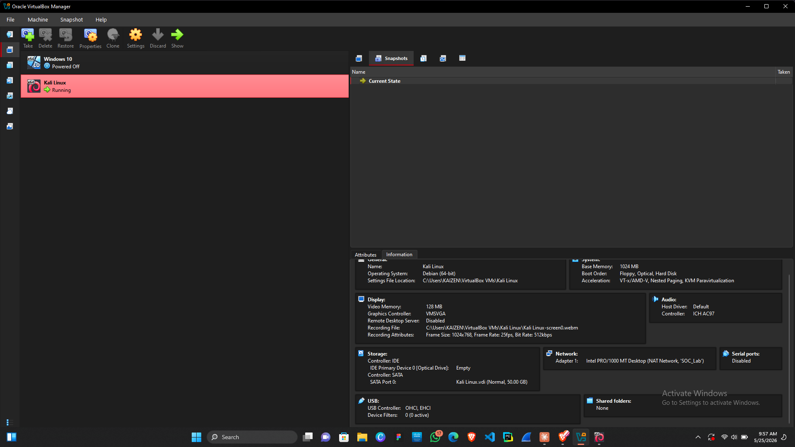
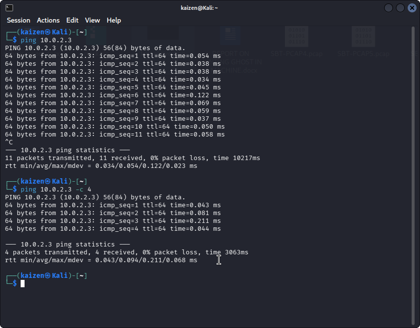

# Project 01 — Home Lab Setup 🏗️

## Objective
Build a virtualized SOC lab environment simulating a real-world enterprise network with a dedicated attacker machine and a defender machine — enabling safe, controlled cybersecurity practice without risk to production systems.

---

## Lab Architecture

```
┌─────────────────────────────────────────────────┐
│                  HOST MACHINE                   │
│                                                 │
│   ┌─────────────────┐   ┌─────────────────┐    │
│   │   Kali Linux    │   │   Windows 10    │    │
│   │   VM            │──▶│   VM            │    │
│   │   (Attacker)    │   │   (Defender)    │    │
│   └─────────────────┘   └─────────────────┘    │
│                                                 │
│   Network: NAT + Host-Only Adapter              │
└─────────────────────────────────────────────────┘
```

---

## Host Machine Specifications

| Component | Details |
|-----------|---------|
| OS | Windows 11 |
| RAM | 8GB |
| CPU | Intel Core i7 |
| Storage | 256GB SSD |
| Virtualization Software | VirtualBox |

---

## Virtual Machines

### 🔵 Windows 10 VM — Defender

| Component | Details |
|-----------|---------|
| OS | Windows 10 |
| RAM | 3GB |
| Storage | 50GB |
| CPU Cores | 2 |
| Role | Defender — Runs Splunk SIEM + SOAR listener |
| Network Adapters | Adapter 1: NAT (internet) / Adapter 2: Host-Only (lab) |

### 🔴 Kali Linux VM — Attacker

| Component | Details |
|-----------|---------|
| OS | Kali Linux Debian 64bit |
| RAM | 2GB |
| Storage | 50GB |
| CPU Cores | 2 |
| Role | Attacker — Runs offensive security tools |
| Network Adapters | Adapter 1: NAT (internet) / Adapter 2: Host-Only (lab) |

---

## Network Configuration

| Setting | Value |
|---------|-------|
| NAT Network | Internet access for both VMs |
| Host-Only Network | 192.168.56.0/24 |
| Windows VM IP | 192.168.56.101 |
| Kali VM IP |  | 10.0.2.3

---

## Setup Process

### Step 1 — Install VirtualBox
- Downloaded VirtualBox from [virtualbox.org](https://www.virtualbox.org)
- Installed on host machine
- Verified installation with `VBoxManage --version`

### Step 2 — Create Windows 10 VM
- Downloaded Windows 10 ISO from Microsoft
- Created new VM in VirtualBox with specified resources
- Installed Windows 10 and completed initial setup
- Configured network adapters (NAT + Host-Only)

### Step 3 — Create Kali Linux VM
- Downloaded Kali Linux ISO from [kali.org](https://www.kali.org)
- Created new VM in VirtualBox with specified resources
- Installed Kali Linux and completed initial setup
- Configured network adapters (NAT + Host-Only)

### Step 4 — Network Configuration
- Created Host-Only network in VirtualBox Network Manager
- Assigned static IPs to both VMs
- Verified connectivity between both VMs with ping tests

### Step 5 — Verify Lab Connectivity
```bash
# From Kali VM — ping Windows VM
ping 192.168.56.101

# From Windows VM — ping Kali VM
ping [KALI IP]
```

---

## Screenshots

### VirtualBox — Both VMs Listed


### Windows 10 VM — Running


### Kali Linux VM — Running


### Network Connectivity — Ping Test


---

## Key Takeaways

- Virtualization allows safe simulation of real attack/defense scenarios
- Proper network segmentation is critical — NAT for internet, Host-Only for lab isolation
- A dedicated attacker VM prevents accidental exposure of the host machine
- Snapshots enable reverting to clean states after each lab exercise

---

## Tools Used

| Tool | Purpose |
|------|---------|
| VirtualBox | Virtualization platform |
| Windows 10 | Defender/SIEM host OS |
| Kali Linux | Attacker OS with security tools |

---

## Next Project
➡️ [Project 02 — SIEM Setup with Splunk](../Project-02-SIEM-Splunk/)

---

*Part of my [SOC Analyst Portfolio](../README.md)*
