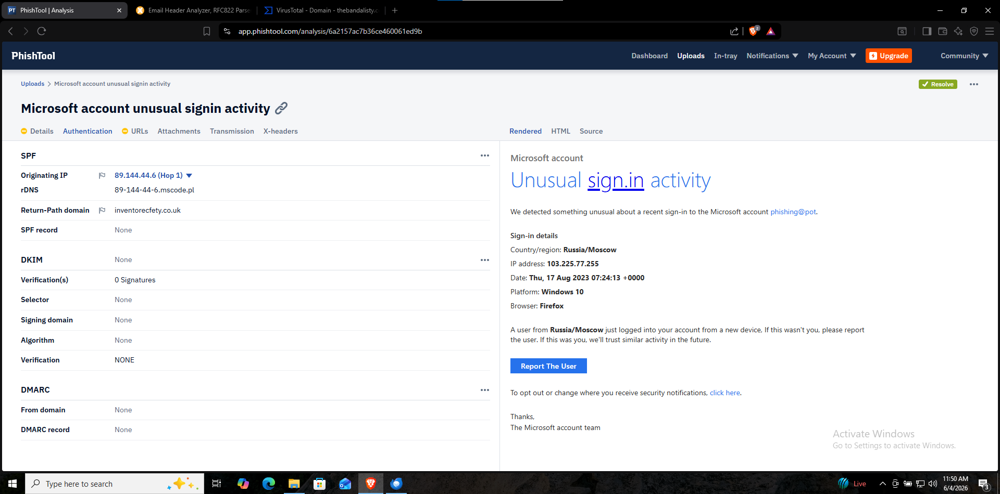
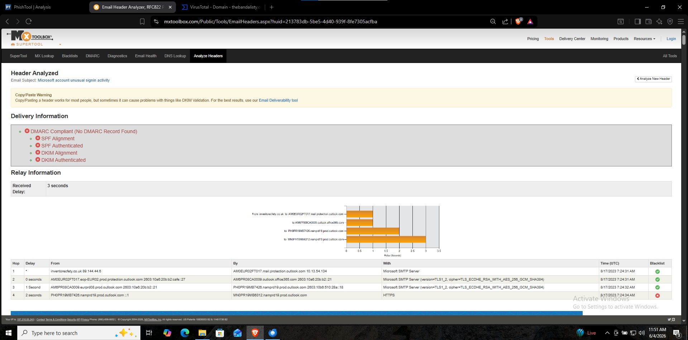
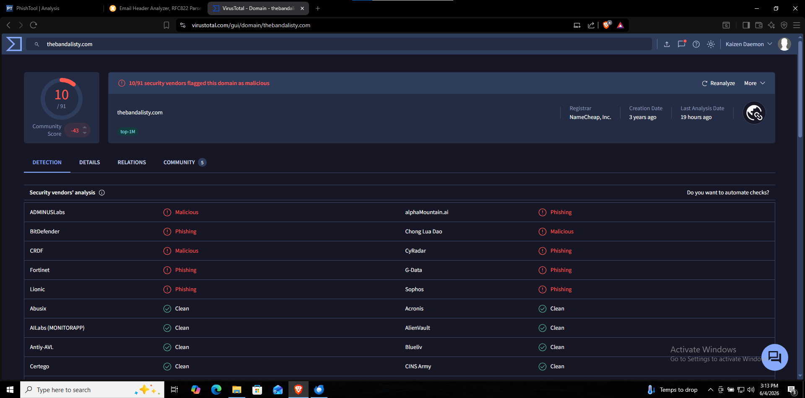

# Project 04 — Phishing Detection & Analysis 🎣

## Objective
Analyze a real-world phishing email impersonating Microsoft to extract Indicators of Compromise (IOCs), understand attacker techniques, and document findings using industry-standard tools.

---

## Tools Used

| Tool | Purpose |
|------|---------|
| Thunderbird | Email viewing and header extraction |
| PhishTool | Automated phishing analysis |
| VirusTotal | Domain and IP reputation |
| AbuseIPDB | IP abuse checking |
| MXToolbox | Email header analysis |

---

## Sample Overview

| Field | Value |
|-------|-------|
| Subject | Microsoft account unusual signin activity |
| Claimed Sender | Microsoft account team |
| Display From | no-reply@access-accsecurity.com |
| Real Sender | bounce@inventorecfety.co.uk |
| Reply-To | solutionteamrecognizd03@gmail.com |
| Sender IP | 89.144.44.6 |
| Date | Thu, 17 Aug 2023 07:24:31 +0000 |

---

## Email Authentication Analysis

| Check | Result | Meaning |
|-------|--------|---------|
| SPF | ❌ None | Sender not authorized to send for this domain |
| DKIM | ❌ None | Email has no digital signature |
| DMARC | ❌ permerror | Domain has no protection policy |

**Verdict:** All three authentication mechanisms failed — classic phishing indicator.

---

## Attack Techniques Identified

### 1. Domain Spoofing
```
Legitimate: no-reply@microsoft.com
Phishing:   no-reply@access-accsecurity.com
```
The attacker registered a lookalike domain `access-accsecurity.com` to impersonate Microsoft. Victims glancing quickly may not notice the difference.

### 2. Compromised Infrastructure
```
Real sending domain: inventorecfety.co.uk (89.144.44.6)
```
The attacker used a compromised legitimate server to send emails. This gives the sending IP a clean reputation — bypassing IP-based spam filters.

### 3. Social Engineering — Fear Tactic
```
"A user from Russia/Moscow just logged into your account"
IP address: 103.225.77.255
```
The attacker fabricated a Russian login attempt to create panic and urgency — pressuring the victim to click "Report The User" without thinking critically.

### 4. Victim Confirmation Trap
```
"Report The User" button → mailto:solutionteamrecognizd03@gmail.com
```
The button doesn't report anything to Microsoft. It opens the victim's email client pre-filled with an email TO the attacker's Gmail — confirming the victim's email address is active.

### 5. Tracking Pixel
```
http://thebandalisty.com/track/o41961LdlOP22448528tYEX49413WOP33636qZsx176
```
A 1x1 invisible image embedded in the email. When the email is opened, it silently sends:
- Victim's real IP address
- Email client type
- Operating system
- Exact time email was opened
- Confirms email address is active

### 6. CSS Obfuscation
The email contains hundreds of meaningless CSS class names designed to confuse automated analysis tools and spam filters.

---

## IOC Summary

| Type | Value | Verdict |
|------|-------|---------|
| IP Address | 89.144.44.6 | Suspicious — compromised server |
| IP Address | 103.225.77.255 | Fake — social engineering |
| Domain | inventorecfety.co.uk | Malicious — real sending domain |
| Domain | access-accsecurity.com | Malicious — fake Microsoft domain |
| Domain | thebandalisty.com | ⛔ Confirmed Malicious — flagged by 5 AV engines |
| Email | solutionteamrecognizd03@gmail.com | Malicious — attacker Gmail |
| URL | thebandalisty.com/track/... | Malicious — tracking pixel |

---

## Threat Intelligence Results

| IOC | AbuseIPDB | VirusTotal | Verdict |
|-----|-----------|------------|---------|
| 89.144.44.6 | Clean | Clean | Compromised legitimate server |
| inventorecfety.co.uk | N/A | Clean | Newly registered malicious domain |
| access-accsecurity.com | N/A | Clean | Newly registered fake domain |
| thebandalisty.com | N/A | ⛔ Flagged (Bitdefender, Fortinet, Lionic, CRDF, ADMINUSLabs) | Confirmed malicious |

---

## MITRE ATT&CK Mapping

| Technique | ID | Description |
|-----------|-----|-------------|
| Phishing | T1566.001 | Spearphishing via email attachment/link |
| Masquerading | T1036 | Fake Microsoft domain |
| Obtain Capabilities: Infrastructure | T1583 | Compromised server for sending |
| Gather Victim Identity Information | T1589 | Tracking pixel harvests victim data |
| User Execution | T1204 | Victim tricked into clicking Report button |

---

## Key Takeaways

1. **Clean IP ≠ Safe** — Attackers use compromised legitimate servers to bypass reputation checks
2. **SPF/DKIM/DMARC failures are definitive red flags** — Legitimate companies always authenticate their emails
3. **Reply-To Gmail is an immediate red flag** — No legitimate company uses Gmail for security notifications
4. **Fear and urgency are classic social engineering tactics** — Always slow down when an email creates panic
5. **Tracking pixels harvest data silently** — Opening a phishing email alone can expose your information
6. **One clean tool result is never enough** — Always cross-reference multiple intelligence sources

---

## Screenshots





---

## Next Project
➡️ [Project 05 — Log Analysis](../Project-05-Log-Analysis/)

---

*Part of my [SOC Analyst Portfolio](../README.md)*
