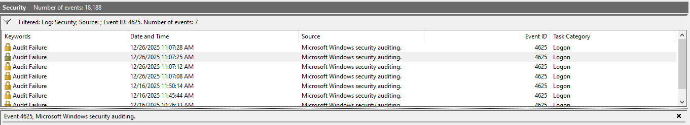
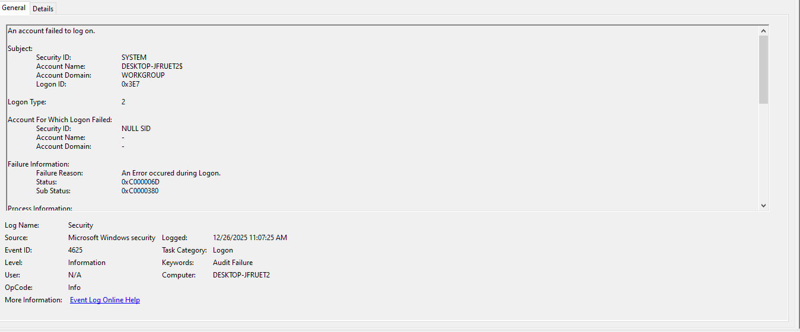
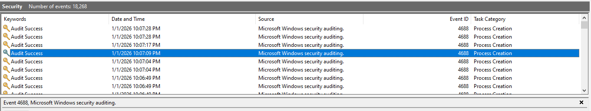
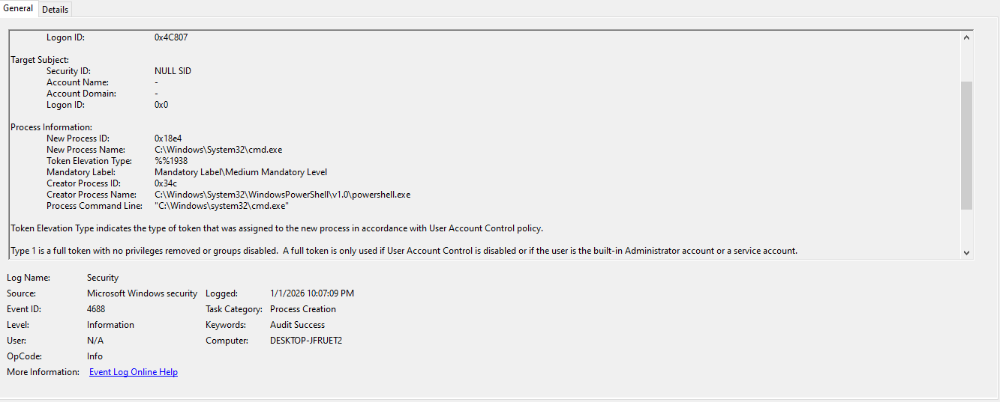

## Incident Summary
- Suspicious authentication failures followed by abnormal process execution activity were observed on a Windows system. The activity warranted further investigation to determine whether it was benign or malicious.

## Environment
- Windows VM
- Event Viewer
- Windows Explorer (explorer.exe)

## Authentication Analysis
- Multiple failed logon attempts (Event ID 4625) were observed in succession, followed by a successful logon (Event ID 4624).
- The logon attempts were identified as Logon Type 2, indicating local interactive authentication.
- While this behavior could be consistent with a user entering incorrect credentials, the frequency of failures required further review for potential brute-force activity.

## Process Execution Analysis
- Abnormal process execution activity was observed following authentication.
- cmd.exe was launched from Windows Explorer.
- powershell.exe was subsequently launched from cmd.exe, forming a suspicious execution chain.
- Command-line activity indicated the use of account enumeration commands, such as `net user`, which added investigative concern.

## Evidence
### Screenshot 1: Filtered Event ID 4625

### ScreenShot 2: Details view for Event 4625

### ScreenShot 3: Filtered Event ID 4688

### Screenshot 4: Details view for Event ID 4688

.png)
.png)

## Correlation and Timeline Analysis
- A sequence of multiple failed logon attempts (4625) followed by a successful authentication (4624) was observed.
- Shortly after successful authentication, suspicious process execution activity occurred.
- The timing of authentication followed by abnormal execution increased the risk level of the observed behavior.

## Analyst Decision
- This activity warrants further investigation due to the combination of repeated authentication failures and suspicious process execution.
- While no definitive malicious activity was confirmed, the observed behavior exceeded normal user activity baselines.
- Escalation to a higher tier or additional monitoring was recommended to determine intent and impact.
