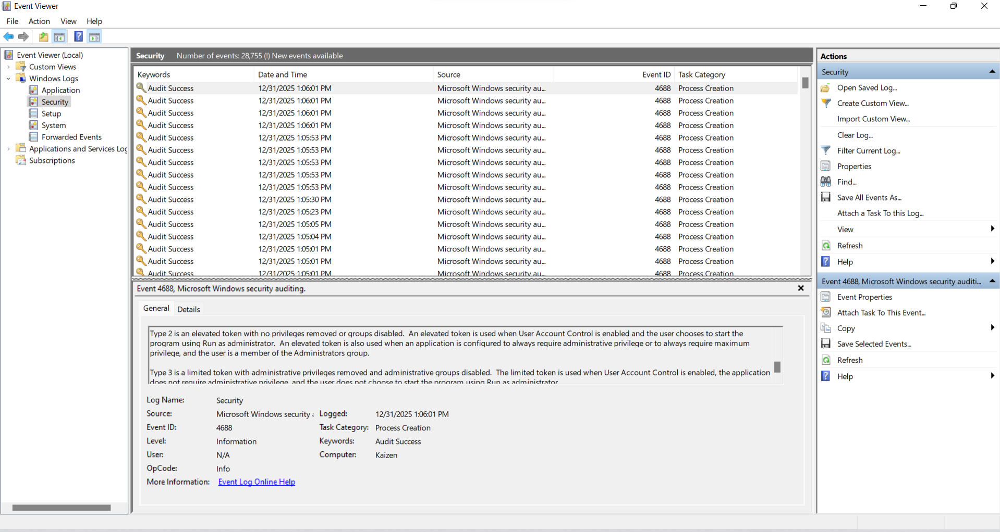
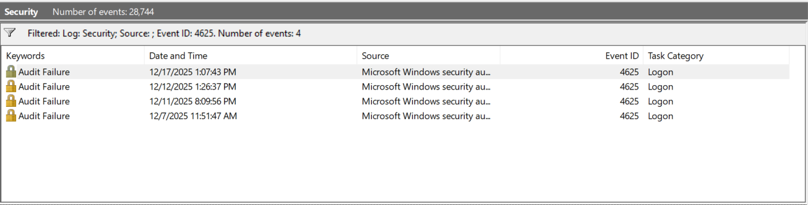
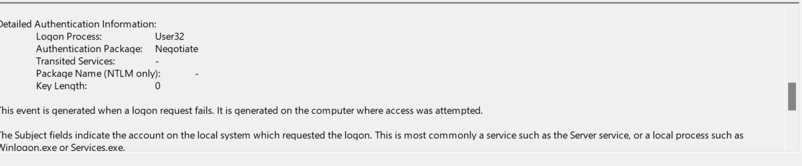

## Goal
Understand basic Windows authentication events and how SOC analysts analyze them.

## Environment
- Windows VM
- Event Viewer
- Local User Account

## Investigation Steps
- Generated a Windows Audite Failure for the user logon
- Filtered Windows Seurity Log for Event 4625 (Failed Logon)
- Reviewed the Event details (Account name, Logon type, Source Network Address and Failure Reasons

## Evidence
### ScreenShot 1: Windows Event Viewer Interface
- 

### ScreenShot 2: Filtered Event Log Showing Event ID 4625
- 

### ScreenShot 3: Event Details for Failed Logon
- 
  
## Findings
- Event ID was generated for each failed logon attempt
- Logon Type 2 indicated interactive (keyboard) login
- Source of the attempt was the local machine
- Failure Reasons indicated an Incorrect Password

## MITRE ATT&CK Mapping
No need for it

## Lessons Learned
- Learnt that Windows Event Viewer is the primary source for authentication logs
- Filtering by Event ID is essential to reduce noise
- Failed logon attempt must be evalauted in context before being considered suspicous

## Analyst Notes
- A small number of failed logon attempts can be normal user behavior.
- Repeated failures in a short time window may indicate brute-force activity.
- Failed authentication events must always be analyzed in context before escalation.
