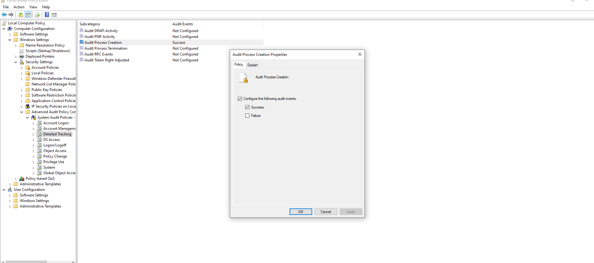
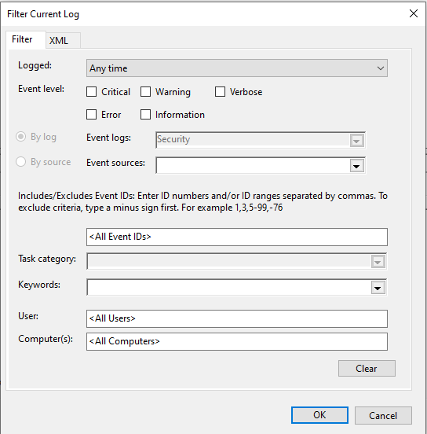
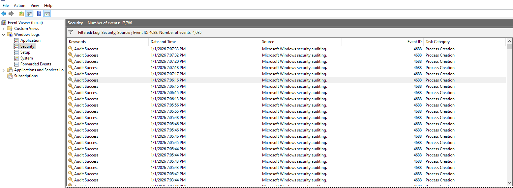
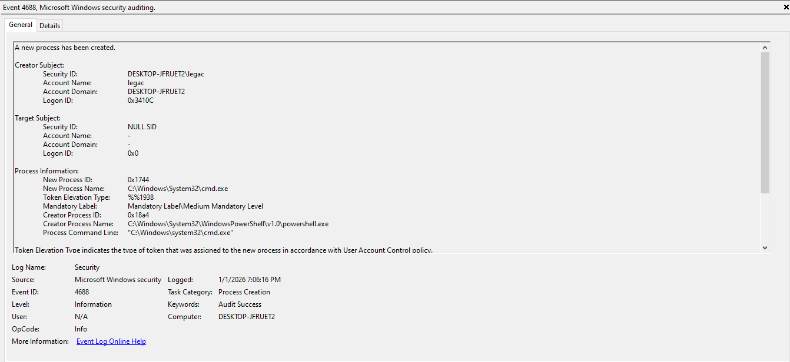
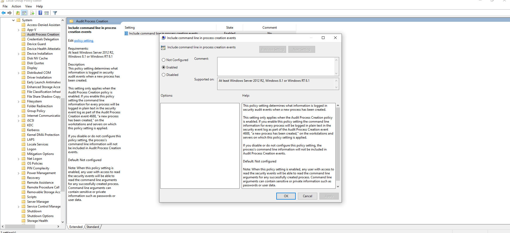

## Goal
Understand how Windows logs process creation and how SOC analyst evaluate execution process.

## Environment
- Windows VM
- Event Viewer
- Local User Account

## Investigation Steps
- Enabled Process Creation Auditing
- Generated Execution process using Windows built-in commands (powershell.exe and cmd.exe)
- Filtered the process to locate Event 4688
- Reviewed Parent and Child process relationship
  
## Evidence
### ScreenShot 1: Enabling Process Auditing
- 
### ScreenShot 2: Filter Window for Event Viewer
- 
### ScreenShot 3: Filtered Event Event 4688 Process Auditing
- 
### ScreenShot 4: Details of the Event ID 4688
- 
### ScreenShot 5: Process Command Line
- 

## Findings
- Event ID 4688 was created when a new process was started
- powershell.exe served as the parent process
- cmd.exe served as the child process
- command line argument described the execution context

## MITRE ATT&CK Mapping
-no application for it in this study

## Lessons Learned
- Learned how process creation provides details on the all active processes
- Learned about the importance of the parent and child process and its importance in detecting suspicious behaviours
- learned to understand the context on the process commandline and their importance in investigation

## Analyst Notes
- The Event 4688 shows us all the Executed processes going on
- The parent-child relationship tells us the origin of the process and what it did
- The Process command line provides context on the type of process that was done
