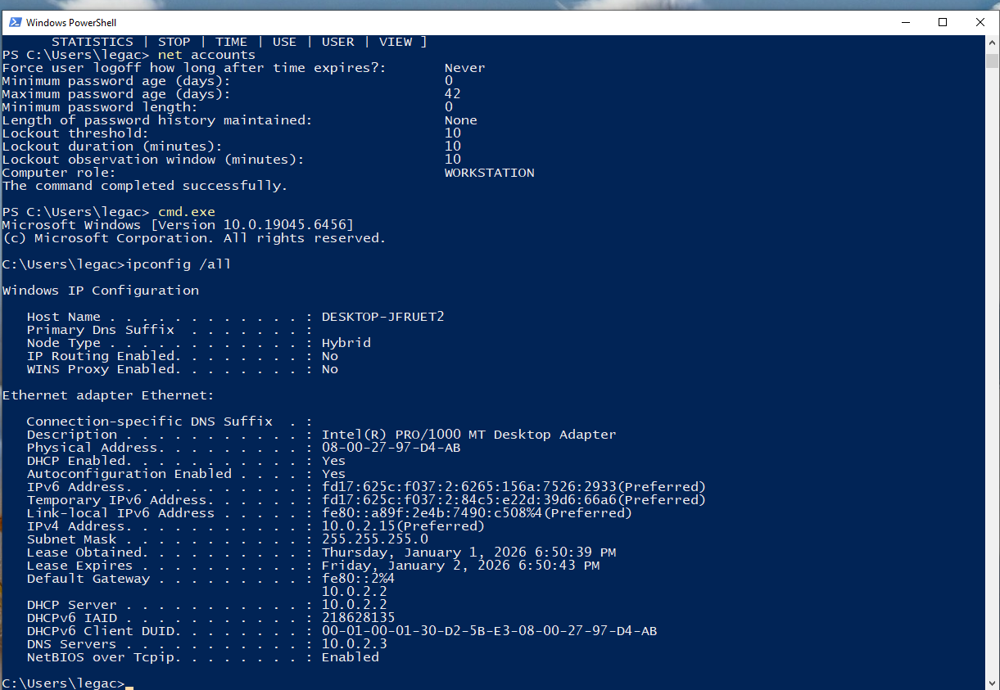
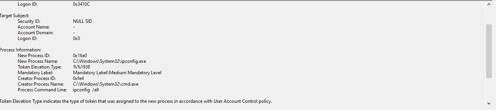

## Goal
Understanding Windows parent-child relatioship to understand suspicous execution chains

## Environment
- Windows VM
- Event Viewer
- Windows explorer (explorer.exe)

## Investigation Steps
- Launched Powershell from Windows Explorer
- Executed cmd.exe from powershell
- Filtered the logs for Event ID 4688
- Analyzed the parent-child relationship

## Evidence
### ScreenShot 1: Launching Powershell on Windows Explorer
- 
### ScreenShot 2: Execution of cmd.exe command on powershell
- 
### ScreenShow 3: Details View Process attention to command-line
- 

## Findings
- powershell.exe was launched by windows.exe
- cmd.exe was launched by powershell.exe
- this process is a suspicious process that deviates from the normal user behaviour and requires further investigation

## MITRE ATT&CK Mapping
- T1059: Command and Scripting Interpreter

## Lessons Learned
- Learned that Powershell can be Lauched through Windows Explorer
- Office or Browsers opening powershell is an indicator of compromise and should be investigated
- Learned the Importance of reading context before escalating suspicious behaviours

## Analyst Notes
- Normal user activities don't often include openning of the terminal throught Windows Exploerer
- The Execution Process are suspicious based on the context from the Process Command Line   
