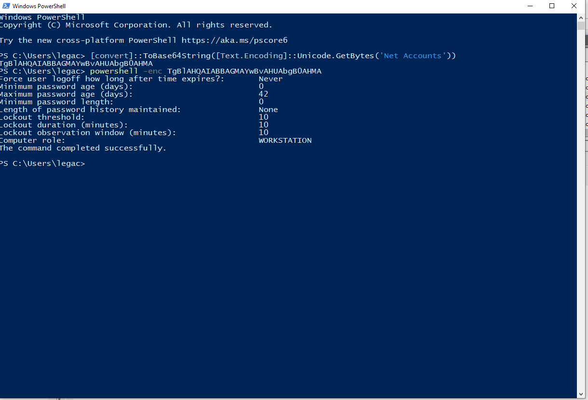
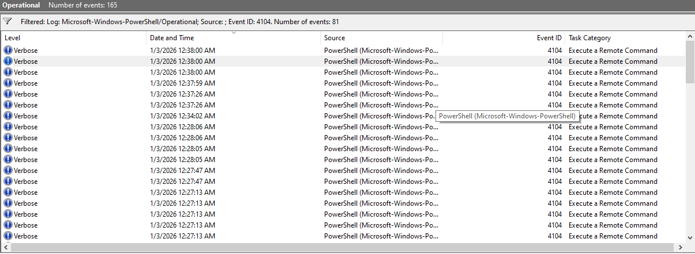
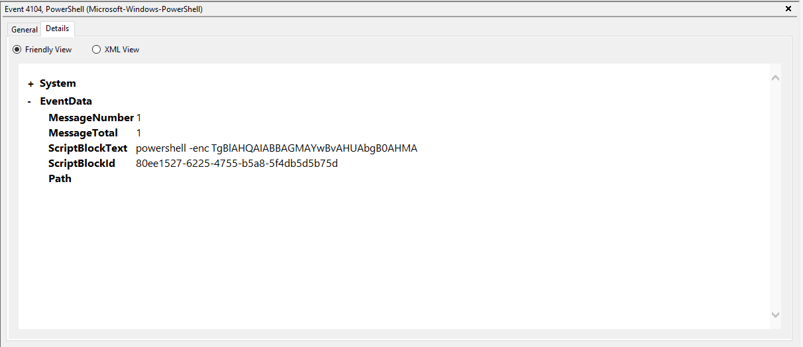
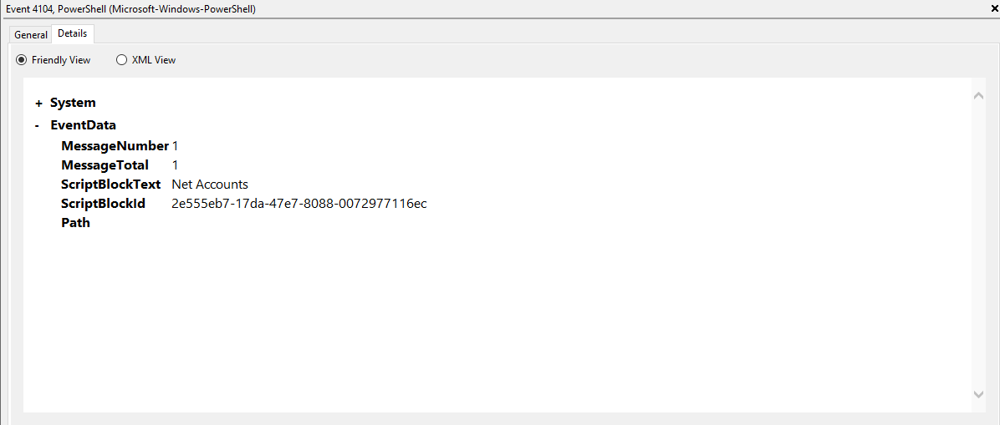

## Goal
Understand Powershell Execution and how SOC analysts evaluate script activities.

## Environment
- Windows VM
- Event Viewer
- Powershell

## Investigation Steps
- Enabled Powershell Script Block Logging
- Executed Powershell Comands
- Event Viewer and Filtered for Event Log 4104
- Reviewed Script BlockText and Execution Command

## Evidence
### ScreenShot 1: Executed Powershell Commands

### ScreenShot 2: Filtered Event Viewer for Event ID 4104

### ScreenShot 3: Details of the Encoded ScriptBlock Text and Execution Context

### ScreenShot 4: Details of the Decoded ScriptBlockText

## Findings
- Powershell and the executed commands were carried out by the logged user
- The Executed Powershell Commands were suspicious
- There was an encoded command

## MITRE ATT&CK Mapping
- T1059.001 - Powershell

## Lessons Learned
- Powershell can be abused by attackers
- Always look for encoded commands if there is any

