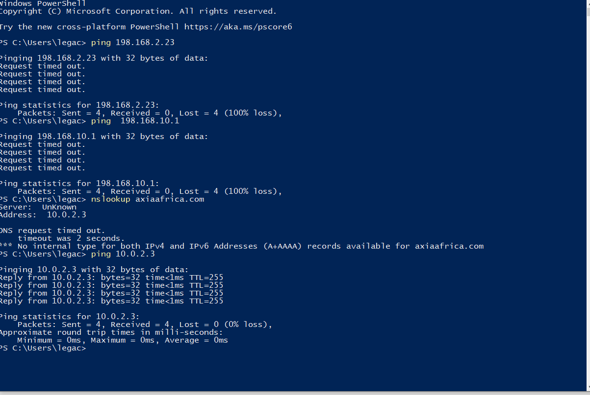
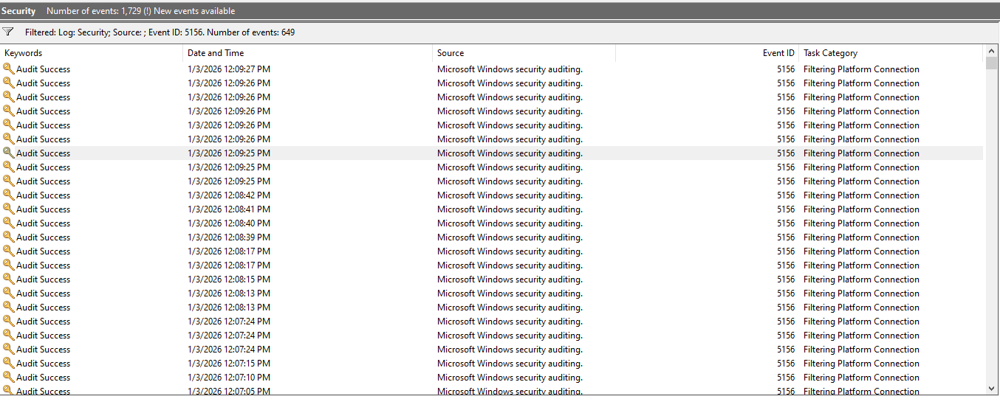
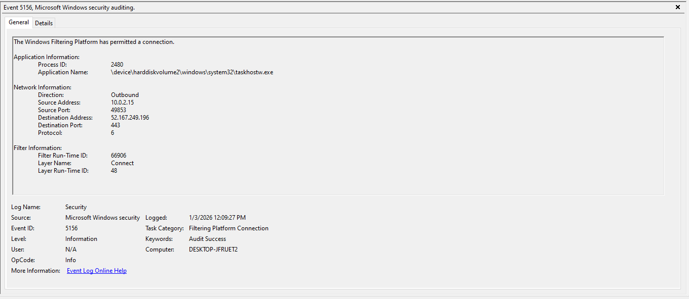

# Log-005: Host-Based Network Connections (Event ID 5156)

## Goal
Understand host-based network connections and how SOC analysts evaluate outbound traffic from Windows systems.

## Environment
- Windows Virtual Machine
- Event Viewer
- Windows Defender Firewall

## Investigation Steps
1. Enabled Windows Defender Firewall logging.
2. Enabled audit policy for Filtering Platform Connection.
3. Generated network activity using PowerShell commands such as `ping` and `nslookup`.
4. Opened Event Viewer and filtered the Security log for Event ID 5156.

## Evidence

### Screenshot 1: PowerShell Commands Executed

### Screenshot 2: Filtered Event ID 5156

### Screenshot 3: Event ID 5156 Details

## Findings
- A process on the host initiated an outbound network connection.
- The destination IP address and destination port were identified.
- The protocol used for the connection (TCP/UDP) was observed.
- The network activity appeared benign based on the process and destination.

## MITRE ATT&CK Mapping
- **T1043** – Commonly Used Port
- **T1071** – Application Layer Protocol

## Lessons Learned
- Host-based network logs provide visibility into outbound connections.
- Identifying the originating process is critical when evaluating network traffic.
- Network activity must be correlated with process execution to assess risk accurately.
