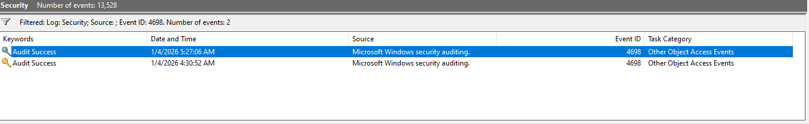
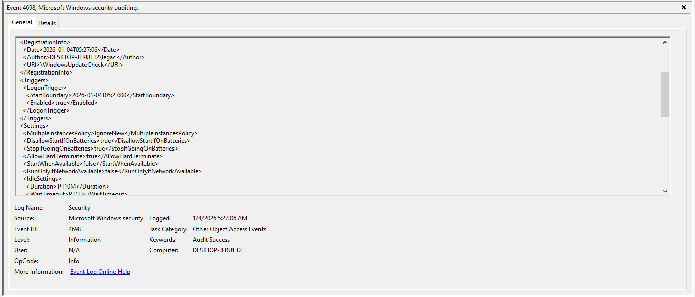
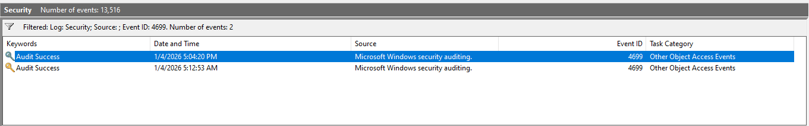
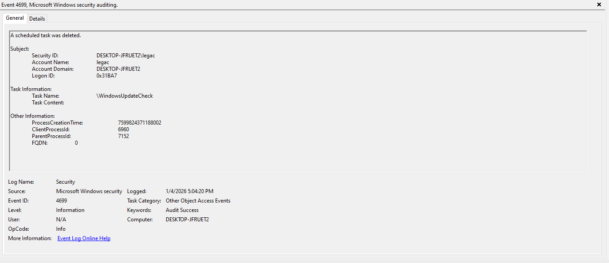

## Goal
Understanding how SOC analysts detect & analyze persistence mechanism using Windows Scheduled Task Log

## Environment
- Windows VM
- Event Viewer
- Task Scheduler

## Investigation Steps
- Enabled Audit Policy for Scheduled task
- Created a Scheduled Task with Command Prompt using Admin Priviledges
- Filtered for Event Log 4698 (Sceduled task created)
- Filtered for Event Log 4699 (Scheduled task deleted)
- Investigated the `task content, trigger type, run as and the trigger`

## Evidence
### ScreenShot 1: Task creation with command promt

### ScreenShot 2: Filtered for Event Log 4698

### ScreenShot 3: Investigation details for Event ID 4698

### ScreenShot 4: Filtered for Event Log 4699

### ScreenShot 5: Investigation details for Event ID 4699

## Findings
- A scheduled task was created on the system using command promt with admin priviledges
- The task executed a recuring activity on every Event 4624
- The task seems suspicious as it contained commands like `-nop, -w hidden,, and -c` which are used for stealth activities
- Task configuration resmbled a persistence behavior

## MITTRE ATT&CK Mapping
- T1053.05 - Scheduled Task/Jobs

## Lessons Learned
- Scheduled tasks are commonly abused for persistence
- Attackers make use of certain commands like `-nop, -w hidden, and the -c` to hide traces of their actions from the users
- Task frequency and persistence are signs of a system security breach
- Persistence must be correlated with previous activities
