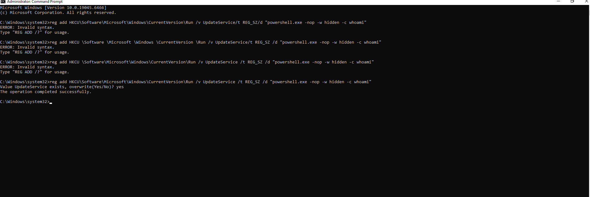
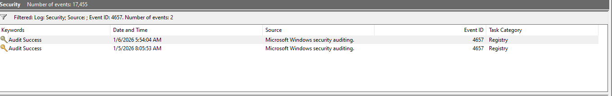
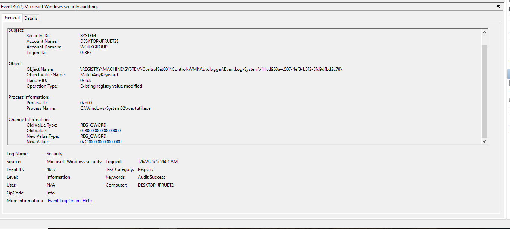

# Log-007: Registry Persistence (Run Keys)

## Goal
Understand how registry keys can be abused for persistence and how SOC analysts detect them.

## Environment
- Windows VM
- Event Viewer
- Windows Command Prompt
- Windows Registry Editor

## Investigation Steps
- Enabled registry auditing via local security policy
- Enabled auditing on the registry Run key
- Created a registry-based persistence mechanism using Command Prompt
- Filtered Security logs for Event ID 4657
- Reviewed registry modification details and execution context

## Evidence

### Screenshot 1: Registry Modification Command

### Screenshot 2: Filtered Event ID 4657

### Screenshot 3: Event ID 4657 Details

## Findings
- A registry value was added to a Run key
- The value executed PowerShell at user logon
- Execution behavior was consistent with persistence activity

## MITRE ATT&CK Mapping
- **T1547.001** – Boot or Logon Autostart Execution: Registry Run Keys

## Lessons Learned
- Registry modification events are only logged when auditing is explicitly enabled
- Registry Run keys are commonly abused for persistence
- Event ID 4657 provides visibility into registry value modifications
- Persistence activity must be correlated with prior authentication and execution events
